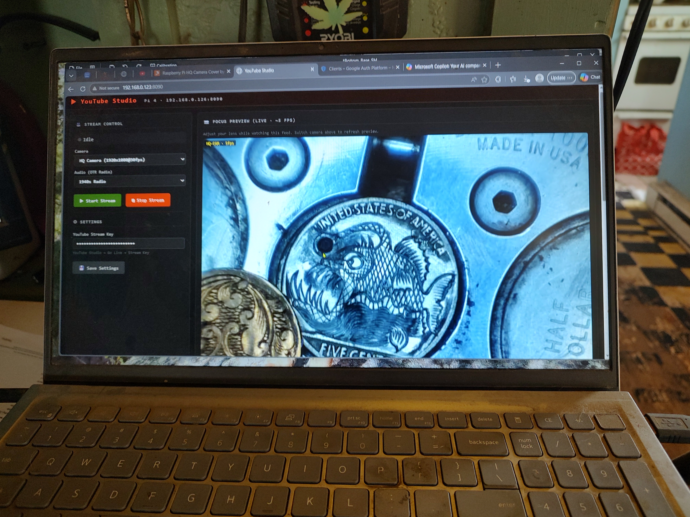
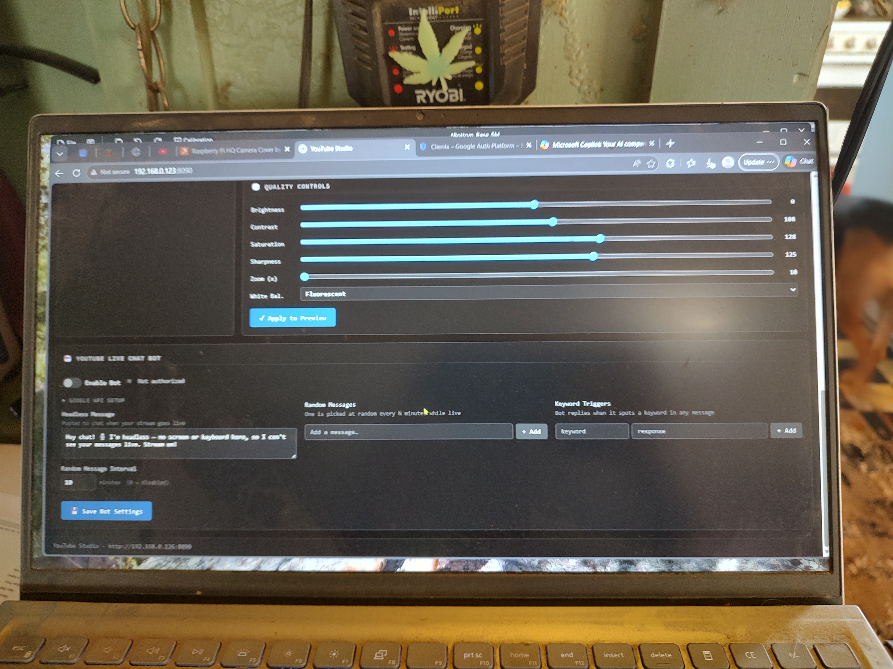
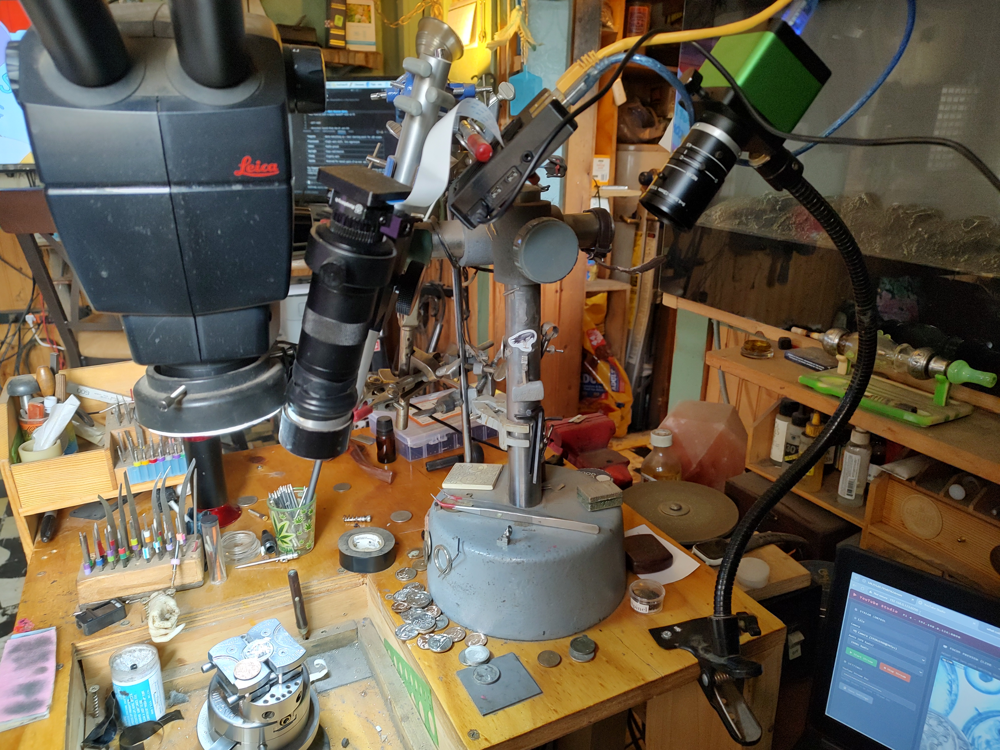
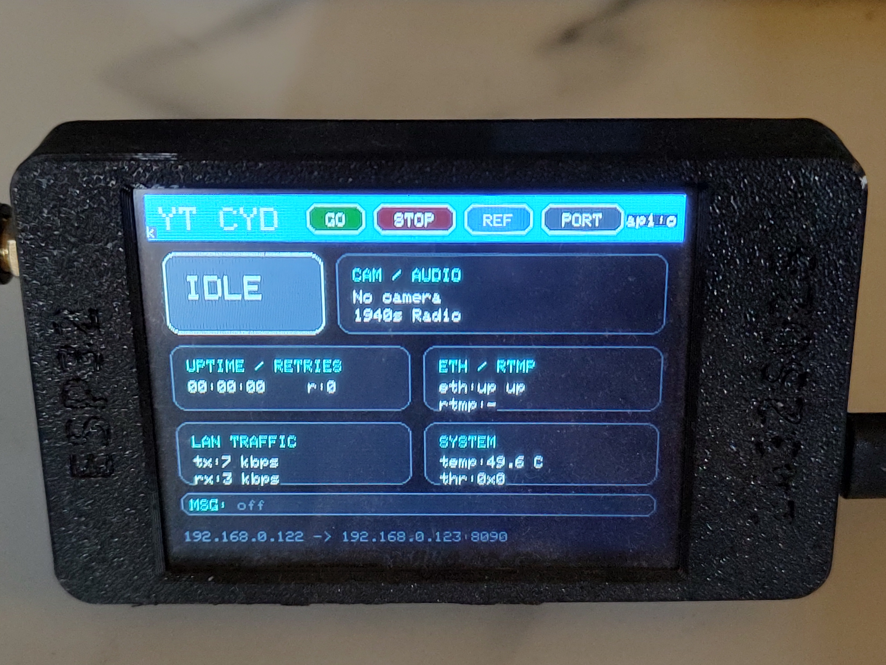
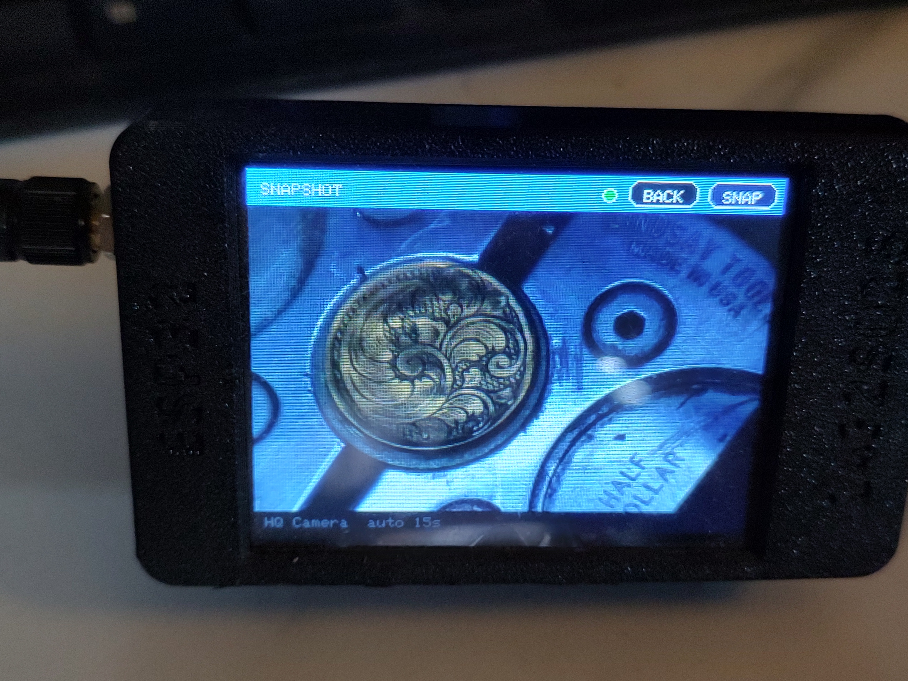
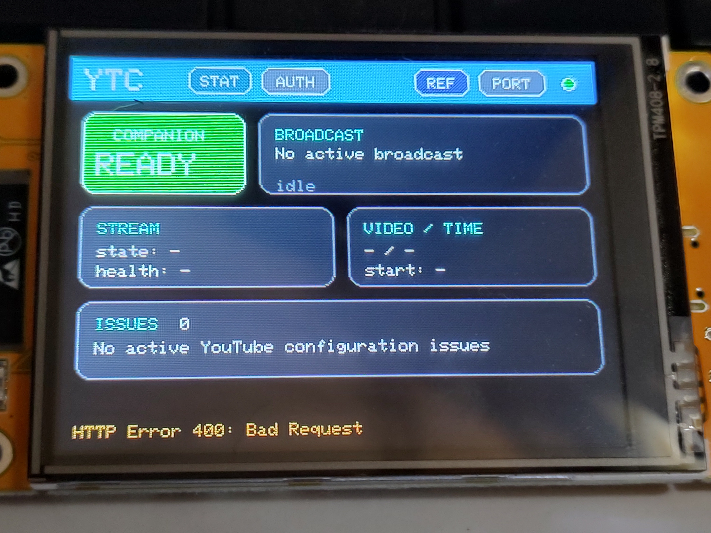

# YouTube-Pi4-StreamMachine

A standalone YouTube live streaming daemon for the **Raspberry Pi 4** — built for a coin engraving workbench but usable for any close-up or studio stream. Browser-based web UI, live MJPEG focus preview, quality controls, mid-stream camera switching, and an optional YouTube Live Chat Bot. No LCD HAT, no physical buttons, no desktop environment required.

Channel: [youtube.com/@coreymillia](https://www.youtube.com/@coreymillia)

---

## Screenshots

### Stream Control + Live Focus Preview

*The left panel controls the stream. The right panel shows a live 5fps MJPEG preview — adjust your lens in real time without clicking a shutter. Here showing an engraved nickel under the HQ camera.*

### Quality Controls + Chat Bot Panel

*Brightness, Contrast, Saturation, Sharpness, Zoom, and White Balance sliders. Below: the YouTube Live Chat Bot configuration panel with headless message, random messages, and keyword triggers.*

### The Bench Setup

*The actual workbench — Leica microscope, HQ camera on a gooseneck arm, engraving tools, polished coins, and the YouTube Studio UI visible on a tablet in the corner. This is what "bench chaos" looks like when it's working.*

### CYD Stream Dashboard

*The ESP32 Cheap Yellow Display acting as a compact stream monitor — live status, LAN traffic, temperature, retries, and one-tap controls without opening the browser UI.*

### CYD Snapshot Mode

*Snapshot mode on the CYD for quick alignment checks. It pulls a still JPEG from the Pi preview path and can auto-refresh or be refreshed manually from the touchscreen.*

### YouTube Companion CYD

*A dedicated CYD for the YouTube Companion service — showing authorized/ready state, no active broadcast yet, and the YouTube-side status cards before going live.*

---

## Hardware

- **Raspberry Pi 4 Model B**
- **Raspberry Pi HQ Camera (IMX477)** — connected via CSI ribbon to the CAM/DISP 0 port (closest to USB-C power)
- **C-mount lens support** — the HQ Camera can use any compatible C-mount lens, so the build is not limited to the engraving lens shown in the photos
- **USB Microscope Camera** — optional, plug-and-play (H264 capable recommended)
- Optional: Bluetooth keyboard for SSH/terminal access without a screen

---

## Features

- **Live MJPEG focus preview** at ~5 fps — adjust your lens while watching. No clicking, no refreshing.
- **Single JPEG snapshot endpoint** for lightweight remote previews such as the CYD dashboard
- **Preview isolation while live** — browser preview and snapshot are disabled during streaming so they do not consume the same uplink as YouTube
- **Rule-of-thirds grid overlay** toggle for shot framing
- **Camera auto-detection** — detects connected cameras at boot, defaults to HQ cam if available
- **Safer camera switch** — switching cameras now does a clean stop/restart of the stream pipeline instead of an in-place hot-swap
- **YouTube RTMP streaming** via `rpicam-vid` (HQ cam) or v4l2 H264 passthrough (USB cam)
- **Quality controls** — Brightness, Contrast, Saturation, Sharpness, Zoom, and White Balance — applied live to preview and stream
- **OTR Radio audio** — 12 Old Time Radio stations from the ROKiT Radio Network overlaid on the HQ cam stream, plus a **No Audio (Silent)** test option
- **Auto-reconnect** — keeps retrying on connection loss instead of stopping after a fixed retry limit
- **CYD companion display** — touch dashboard for stream state, Ethernet health, system temperature, and quick controls
- **CYD snapshot mode** — lightweight still-image camera alignment view with manual refresh and timed auto-refresh
- **YouTube Live Chat Bot** *(optional / not yet validated on this bench)* — included for headless messages, random timed messages, and keyword-triggered replies
- **Stream key saved locally** — stored in `config.json`, never transmitted anywhere else
- **Auto-starts on boot** via systemd

---

## OS

Flash with **Raspberry Pi OS Lite 64-bit (Bookworm)**. No desktop needed.

---

## Installation

### 1. Install dependencies

```bash
sudo apt update
sudo apt install -y ffmpeg v4l-utils rpicam-apps python3-pip
pip3 install requests
```

### 2. Clone and set up

```bash
git clone https://github.com/Coreymillia/YouTube-Pi4-StreamMachine.git /home/coreymillia/youtube-studio
cd /home/coreymillia/youtube-studio
cp config.example.json config.json
```

### 3. Enable the systemd service

```bash
sudo cp systemd/youtube-studio.service /etc/systemd/system/
sudo systemctl daemon-reload
sudo systemctl enable youtube-studio.service
sudo systemctl start youtube-studio.service
```

The service auto-starts on every boot. Check it with:

```bash
sudo systemctl status youtube-studio
sudo journalctl -u youtube-studio -f    # live logs
```

---

## Web UI

Open a browser on any device on the same network:

```
http://<pi-ip>:8090
```

| Endpoint | Description |
|---|---|
| `/` | Main dashboard |
| `/preview` | Raw MJPEG feed |
| `/snapshot` | Single JPEG frame from the current preview camera |
| `/status` | JSON status (running, uptime, cams, quality) |
| `/bot_status` | JSON chat bot status |

---

## YouTube Companion (Pi Zero 2 W)

The main Pi can now be paired with a separate **Pi Zero 2 W companion** that watches the **YouTube-side** view of the stream instead of the local encoder side. This is useful for answering questions like:

- Is YouTube currently seeing the broadcast as **live**, **ready**, or **ended**?
- Is the bound live stream currently **active**, **inactive**, or **noData**?
- Is YouTube reporting stream-health issues or configuration warnings?

The companion is intended to run separately from the encoder Pi so the main Pi stays focused on camera, audio, and RTMP upload.

### Companion files

| Path | Purpose |
|---|---|
| `YouTubeCompanion/youtube_companion.py` | Device-auth + YouTube polling service |
| `YouTubeCompanion/config.example.json` | Example config for client ID/secret and listen port |
| `YouTubeCompCYD/` | Dedicated CYD firmware for the companion Pi's `/status` + `/auth_status` APIs |
| `INVERTYouTubeCompCYD/` | Inverted/touch-calibrated companion CYD firmware variant |
| `systemd/youtube-companion.service` | Example systemd unit for the Pi Zero |

### What it exposes

- `GET /` — tiny local dashboard for auth + current YouTube status
- `GET /status` — JSON summary for a future CYD or other client
- `GET /auth_status` — current device-auth state
- `POST /auth/start` — start Google device authorization
- `POST /auth/clear` — clear saved token

### Pi Zero setup

```bash
sudo apt update
git clone https://github.com/Coreymillia/YouTube-Pi4-StreamMachine.git /home/coreymillia/youtube-companion-src
mkdir -p /home/coreymillia/youtube-companion
cp /home/coreymillia/youtube-companion-src/YouTubeCompanion/youtube_companion.py /home/coreymillia/youtube-companion/
cp /home/coreymillia/youtube-companion-src/YouTubeCompanion/config.example.json /home/coreymillia/youtube-companion/config.json
sudo cp /home/coreymillia/youtube-companion-src/systemd/youtube-companion.service /etc/systemd/system/
sudo systemctl daemon-reload
sudo systemctl enable --now youtube-companion.service
```

Then open:

```text
http://<pi-zero-ip>:8091
```

Paste the OAuth client ID and secret, save them, and start device auth.

> The companion uses **YouTube readonly scope** only. It is meant for **status/health polling**, not for controlling YouTube Studio or posting chat messages.

### Google Auth Platform setup for the companion

If Google says the app "**has not completed the Google verification process**", that usually means the OAuth app is not configured for testing with your account yet.

1. In [Google Cloud Console](https://console.cloud.google.com/), select the project that owns your companion client ID.
2. Enable **YouTube Data API v3** for that project if it is not already enabled.
3. Go to **Google Auth Platform**.
4. Open **Branding**. If Google Auth Platform is not configured yet, click **Get started**.
5. Fill in the basic app details:
   - **App name**: anything you want, such as `YouTube Pi4 StreamMachine`
   - **User support email**: your email
   - **Audience**: **External**
   - **Contact information**: your email
6. Finish the setup and create the OAuth app.
7. Open **Audience** and, under **Test users**, add the exact Google account that owns your YouTube channel.
8. Open **Clients** and create an OAuth client of type **TVs and Limited Input devices**.
9. Copy that client ID and client secret into the companion web UI and start device auth again.

For the companion's readonly polling flow, **Testing + your account listed as a test user is enough**. Full Google verification is only needed if you want to distribute the app broadly to users outside your own test list.

### Companion auth flow

1. Open `http://<pi-zero-ip>:8091`
2. Paste the **client ID** and **client secret**
3. Click **Save Settings**
4. Click **Start Device Auth**
5. On another device, open [google.com/device](https://www.google.com/device)
6. Sign in with the **same Google / YouTube account** that owns the channel
7. Enter the code shown on the companion UI and approve access

Once authorized, the companion will poll YouTube and show broadcast state, stream state, and configuration issues for your channel's current live setup.

The companion starts polling automatically on boot. If you are **not currently live**, it may show **authorized** plus **no active broadcast** or an empty stream section; once the main encoder Pi starts sending to YouTube, the companion UI updates on its own.

> **Auth lifetime note:** while your Google OAuth app is in **Testing**, Google may expire the companion authorization after about **7 days** for test users. If that happens, just start device auth again from the companion UI. The CYD does **not** perform Google OAuth itself.

### Companion CYD firmware

A separate CYD can now be dedicated to the YouTube-side view by flashing the firmware in `YouTubeCompCYD/`.

If you are using the inverted CYD variant that matches the calibration from `CYDWiFiScanner/InvertedCYDWifiScanner`, use `INVERTYouTubeCompCYD/` instead.

What it does:

- Connects to the companion Pi on port `8091`
- Shows whether the companion is online and authorized
- Shows the current YouTube broadcast title/lifecycle/privacy state
- Shows stream state, health, resolution, and first active issue
- Includes an auth page that shows the current device code and can trigger `Start Device Auth` / `Clear Token`
- Includes the same Wi-Fi captive portal pattern as the main `YouTubeCYD`

To build and flash:

```bash
cd YouTubeCompCYD
pio run
pio run -t upload
```

On first boot, connect to the CYD setup AP:

```text
YouTubeCompCYD-Setup
```

Then enter your Wi-Fi details and the companion Pi hostname/IP, usually:

```text
Host: 192.168.0.129
Port: 8091
```

The CYD stores its Wi-Fi and host settings locally, so this setup is typically **one-time per device** unless you clear settings, reflash, or change networks/hostnames.

> **Screenshot safety:** avoid committing companion auth screenshots that show an active device code or client details. The CYD hardware photo is generally safe; the auth UI photo is better kept private unless fully redacted.

---

## Dashboard Sections

### Stream Control
- Live/idle status dot and uptime timer
- Camera selector (auto-populated from detected cameras)
- OTR audio station selector
- **Start Stream** / **Stop Stream** buttons
- **↺ Switch Camera** button — appears only while streaming, performs a short stop/restart on the selected source for a safer recovery path
- Optional **Away / Break Message** text box and toggle for showing a message on the live stream video

### Focus Preview
- Live 5fps MJPEG feed from the selected camera
- Toggle rule-of-thirds grid overlay
- Refresh Preview button
- Switching the camera dropdown automatically updates the preview
- Preview/snapshot are disabled while streaming so the uplink is reserved for YouTube

### Quality Controls
All settings apply to both the live preview and the stream. Hit **Apply to Preview** to commit.

| Slider | Range | Notes |
|---|---|---|
| Brightness | -100 → +100 | 0 = no change. Lift the image if your scene is dark. |
| Contrast | 0 → 200 | 100 = neutral. For shiny metal/coins, keep near neutral — high contrast blows out highlights. |
| Saturation | 0 → 200 | 100 = neutral. Lower this if your LED lighting causes a color cast. |
| Sharpness | 0 → 200 | 100 = neutral. Don't push too high — creates artifacts on metal edges. |
| Zoom (x) | 1.0× → 4.0× | Center crop using the sensor ROI. 1.0 = full frame. |
| White Bal. | dropdown | See table below — the single most impactful setting for LED-lit setups. |

**White Balance modes:**

| Mode | Best for |
|---|---|
| Auto | Camera guesses — can be thrown off by LEDs |
| Tungsten | Warm indoor lighting; may skew blue under some LED ring lights |
| Fluorescent | Shop/fluorescent overhead lighting |
| Indoor | Mixed indoor light |
| **Daylight** | **Best starting point for this engraving setup and LED ring lighting** |
| Cloudy | Overcast outdoor |
| Custom | Reserved for manual gains |

> **Tip for coin engraving / polished metal:** Start with **Daylight** white balance, drop Saturation to ~70–80, and leave Contrast near 100. On this setup, **Tungsten** pushed the image too blue under the LED ring light.

### Settings
- YouTube stream key (password field, saved to `config.json` on the Pi)
- Optional stream message overlay text + on/off toggle

### CYD Dashboard
- Compact touchscreen dashboard for **GO / STOP / REF / PORT**
- Shows stream state, selected camera, OTR audio source, LAN traffic, RTMP/Ethernet state, retries, and system temperature
- Uses `/status` for health data and control actions

### CYD Snapshot Mode
- Opened from the **SHOT** button on the CYD
- Pulls a single JPEG from `/snapshot`
- Auto-refreshes every **15 seconds**
- Includes a manual **SNAP** button for immediate refresh
- Designed for framing/alignment, not full live video

---

## Camera Notes

### HQ Camera (IMX477)

- Ribbon to **CAM/DISP 0** port — closest to the USB-C power port
- Blue contacts on the ribbon face **toward the HDMI ports**
- CSI cameras are detected at **boot** — plug in before powering on
- Streams at **854×480 @ 30fps** via `rpicam-vid` hardware encoder (reduced during this session to stabilize YouTube ingest on a jittery uplink)
- Preview at **640×480 @ 5fps**

### USB Microscope Camera

- Plug and play — no reboot required
- Streams at **1280×720 @ 30fps** via v4l2 H264 passthrough (no CPU re-encoding)
- Audio: silent AAC (YouTube requires an audio track)

---

## Audio

The HQ Camera stream overlays live audio from the **ROKiT Radio Network OTR** streams. Pick a station in the UI:

1940s Radio *(default)* · American Comedy · American Classics · Jazz Central · Comedy Gold · Mystery Radio · Crime & Suspense · Crime Radio · Adventure Stories · Drama Radio · Nostalgia Lane · Science Fiction

You can also choose **No Audio (Silent)** to test the video path without depending on the external radio stream.

USB cam uses silent AAC to satisfy YouTube's audio requirement.

---

## Getting a YouTube Stream Key

1. Go to [YouTube Studio → Go Live](https://studio.youtube.com/)
2. On the stream setup page, leave it on the **Default stream key**
3. Click **How to use the encoder**
4. Copy the stream key from the panel that opens
5. Paste it into the YouTube-Pi Settings panel and click **Save Settings**

> You do **not** need to generate a new key every night if you keep using the default/persistent stream key in YouTube Studio.

---

## YouTube Live Chat Bot (Optional / Experimental)

The chat bot is included to post messages to your YouTube Live chat automatically — useful when you're streaming headless with no keyboard or screen and can't read or respond to chat yourself.

> **Current status:** the bot UI and OAuth flow are included, but it has **not yet been fully validated during a real stream on this bench**, so treat it as experimental until you confirm it on your own setup.

### What it does

- Posts a **headless message** when your stream goes live (e.g. *"Hey chat! I'm headless — no screen or keyboard, so I can't see your messages. Stream on!"*)
- Posts a **random message** from your list at a configurable interval (e.g. every 10 minutes)
- Responds to **keyword triggers** — if someone types a keyword, the bot replies with a preset response
- Everything toggleable — the bot only runs when **Enable Bot** is checked AND a stream is live

### Google Cloud Setup (one-time)

The bot uses the YouTube Data API v3 with OAuth2. Google requires a verified project to post to chat. This is free.

**Step 1 — Create a Google Cloud project**
1. Go to [console.cloud.google.com](https://console.cloud.google.com/)
2. Create a new project (or use an existing one)
3. In the left menu: **APIs & Services → Library**
4. Search for **YouTube Data API v3** → click it → click **Enable**

**Step 2 — Create OAuth2 credentials**
1. Go to **APIs & Services → Credentials**
2. Click **+ Create Credentials → OAuth 2.0 Client ID**
3. If prompted to configure auth first, Google may now send you to **Google Auth Platform** instead of the older **OAuth consent screen** page:
   - Open **Branding** and click **Get started** if needed
   - Set an app name, support email, and contact email
   - Set **Audience** to **External**
   - Save the app
   - Open **Audience** and add your YouTube account email under **Test users**
4. Back at Create Credentials → OAuth 2.0 Client ID:
   - Application type: **TV and Limited Input devices** ← this is critical, do NOT choose "Web application"
   - Name it anything (e.g. `YouTube-Pi Bot`)
   - Click **Create**
5. Copy the **Client ID** and **Client Secret**

> **Why "TV and Limited Input devices"?** Google does not allow IP addresses as OAuth redirect URIs for web apps. The TV/device flow uses a code you enter on a second device — no redirect URI needed. This is exactly what headless Pi setups require.

**Step 3 — Authorize in the web UI**
1. Open the YouTube Studio web UI → scroll to the **YouTube Live Chat Bot** panel
2. Expand **Google API Setup**
3. Paste your **Client ID** and **Client Secret** → click **Save Credentials**
4. Click **↺ Start Authorization**
5. A code box appears — go to **[google.com/device](https://www.google.com/device)** on any phone or laptop
6. Enter the code shown in the UI
7. Sign in with the Google account that owns your YouTube channel
8. Grant the permissions → the UI will show ✓ Authorized

Tokens are saved to `token.json` on the Pi. You won't need to re-authorize unless you revoke access.

If Google says the app has "**not completed the Google verification process**", make sure the Google account you are signing into has been added under **Google Auth Platform → Audience → Test users** for the same Cloud project that owns the client ID.

**Step 4 — Configure the bot**
- **Headless Message** — posted once when stream goes live
- **Random Messages** — add as many as you want; one is picked randomly every N minutes
- **Keyword Triggers** — add a keyword + response pair; bot replies when it spots the keyword in any chat message (case-insensitive)
- **Interval** — how often (in minutes) a random message is posted (0 = disabled)
- Click **Save Bot Settings**, then enable the toggle

### Bot config in `config.json`

```json
"chat_bot": {
  "enabled": true,
  "oauth_client_id": "...",
  "headless_message": "Hey chat! I'm headless — no screen or keyboard here.",
  "random_messages": ["Stream on!", "Thanks for watching!"],
  "keyword_triggers": { "hello": "Hey! 👋", "link": "Check the description!" },
  "random_interval_minutes": 10
}
```

OAuth tokens are stored separately in `token.json` (gitignored — never committed).

---

## Network

Binds to `0.0.0.0:8090`. Works on Wi-Fi and Ethernet. This setup is intended to use **Wi-Fi for the setup UI** and **Ethernet for the live YouTube uplink**. If you switch interfaces, restart the service and the IP in the UI header updates.

On Pi 4 systems that show `bcmgenet ... NETDEV WATCHDOG` transmit queue stalls on `eth0`, the bundled systemd service disables **EEE**, **GRO**, and **GSO** on startup before launching the daemon.

---

## Service Management

```bash
sudo systemctl status youtube-studio     # check running state
sudo systemctl restart youtube-studio    # restart daemon
sudo systemctl stop youtube-studio       # stop
sudo journalctl -u youtube-studio -f     # live log tail
```

---

## Configuration Reference

All settings are stored in `config.json` on the Pi. Most are managed via the web UI.

| Field | Default | Description |
|---|---|---|
| `youtube_stream_key` | `""` | YouTube RTMP stream key |
| `otr_station_url` | 1940s Radio URL | Audio station for HQ cam stream; can also be set to the UI's **No Audio (Silent)** option |
| `stream_message.enabled` | `false` | Shows the custom message on the live stream video |
| `stream_message.text` | `""` | Message text for breaks, away time, or status notes |
| `quality.brightness` | `0.0` | -1.0 to 1.0 |
| `quality.contrast` | `1.0` | 0.0 to 2.0 (1.0 = neutral) |
| `quality.saturation` | `1.0` | 0.0 to 2.0 (1.0 = neutral) |
| `quality.sharpness` | `1.0` | 0.0 to 2.0 (1.0 = neutral) |
| `quality.zoom` | `1.0` | 1.0 to 4.0× center crop |
| `quality.awb` | `"auto"` | White balance mode |
| `chat_bot.*` | — | See Chat Bot section above |

---

## Project Structure

```
YouTube-Pi4-StreamMachine/
├── youtube_studio.py            # Entire daemon — web server, preview, stream, bot
├── config.example.json          # Copy to config.json and edit
├── systemd/
│   └── youtube-studio.service  # systemd unit — auto-start on boot
└── README.md
```

> `config.json` and `token.json` are gitignored and stay on the Pi only.

---

## Stability Notes from This Session

- The HQ stream no longer runs the HQ preview at the same time. Opening the CSI camera twice caused repeated reconnects and broken FLV headers.
- Camera switching now uses a clean stream restart instead of trying to hot-swap the encode pipeline in place.
- The backend now rejects unavailable cameras, which prevents stale browser selections from trying to start a disconnected USB camera.
- A silent-audio option was added to help isolate external-audio issues from video/network issues during troubleshooting.
- The default HQ streaming profile is currently tuned for **stability over maximum resolution**.
- The systemd unit now disables `eth0` EEE/GRO/GSO at startup to reduce Raspberry Pi 4 `bcmgenet` transmit-queue watchdog stalls during long Ethernet-backed streams.
